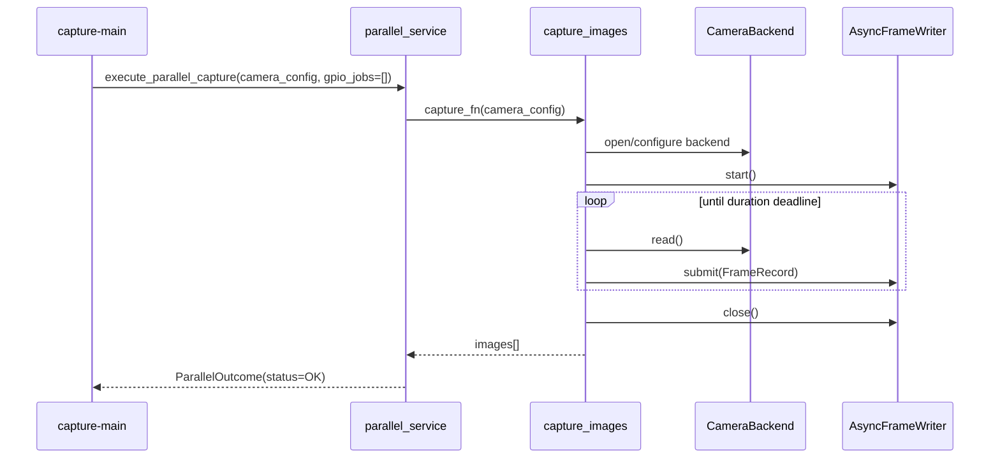
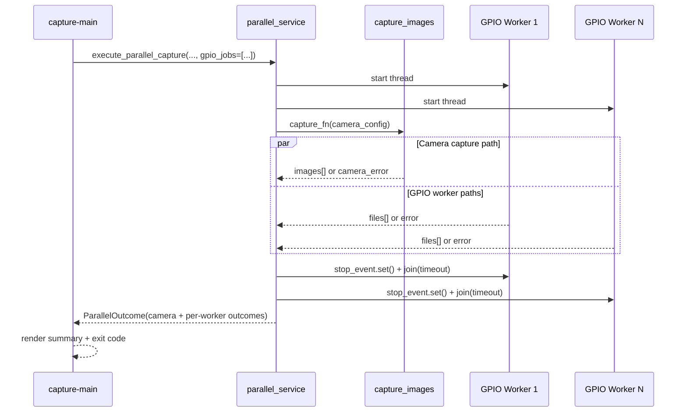

# Camera Capture App

Simple Python application that uses OpenCV to read from a USB camera (for example, Logitech)
and save images to a directory for a fixed duration (default: 5 seconds).

## Table Of Contents

- [Project Structure](#project-structure)
- [Setup](#setup)
- [Usage](#usage)
- [Architecture Reference](#architecture-reference)
- [System Layers](#system-layers)
- [Runtime Flows](#runtime-flows)
- [Execution Sequences](#execution-sequences)
- [Design Decisions](#design-decisions)
- [Error Model](#error-model)
- [Operational Notes](#operational-notes)
- [Linux Camera Smoke Test](#linux-camera-smoke-test)
- [Run Tests](#run-tests)
- [Doxygen Documentation](#doxygen-documentation)

## Project Structure

- `src/camera_capture/`: camera runtime and the standalone camera CLI
- `src/gpio_capture/`: GPIO runtime and the standalone GPIO CLI
- `src/capture_shared/`: shared camera options, output helpers, and parallel orchestration
- `src/parallel_cli.py`: unified camera/GPIO CLI
- `tests/`: pytest test suite (unit and optional hardware tests)
- `scripts/`: operational scripts (camera smoke test and doxygen scrubber)
- `docs/doxygen/`: Doxygen config and supporting documentation assets
- `pyproject.toml`: package metadata, dependencies, test config, and CLI entrypoint

## Setup

```bash
python -m venv .venv
source .venv/bin/activate
pip install -e '.[dev]'
```

### Ubuntu Docker Container

The included `Dockerfile` builds an Ubuntu 24.04 development image with Python,
OpenCV runtime libraries, GStreamer, Video4Linux tools, and libgpiod.

Build the image and run the non-hardware tests:

```bash
docker compose build
docker compose run --rm tests
```

On a Linux host, pass `/dev/video0` through to the container and capture images:

```bash
docker compose run --rm camera-capture
```

Images are written to `./captures/images` on the host. To select another camera
or duration:

```bash
CAMERA_DEVICE=/dev/video1 CAPTURE_DURATION=10 docker compose run --rm camera-capture
```

For GPIO capture, pass the GPIO chip as an additional device and provide the
normal application arguments:

```bash
docker compose run --rm --device /dev/gpiochip0 camera-capture \
  capture-main \
  --camera-output-dir /workspace/captures/images \
  --gpio-output-dir /workspace/captures/gpio \
  --duration 5 \
  --gpio gpiochip0:17:door:both
```

In Visual Studio, open the repository folder, build the `Dockerfile`, and use
`compose.yaml` as the Compose project. From its integrated terminal, the same
`docker compose` commands above work without IDE-specific configuration.

> **USB note:** `/dev/video*` device passthrough is native on Linux. Docker Desktop
> on Windows or macOS runs containers in a VM and usually does not expose a host
> USB camera this way. Tests and development still work there, but live capture
> needs the camera attached to a Linux Docker host (or forwarded into WSL 2/its VM).

## Usage

The package installs three entry points:

- `camera-capture`: standalone camera capture and benchmark workflows
- `camera-gpio-edge`: standalone GPIO edge logging
- `capture-main`: unified camera and GPIO orchestration

See [ARCHITECTURE.md](ARCHITECTURE.md) for the canonical package design, runtime flows,
extension guidance, and verified CLI examples.

### Start The Program (Examples)

Start camera-only capture (no GPIO workers):

```bash
capture-main \
  --camera-output-dir ./captures/images \
  --duration 5
```

Start GPIO-only style run (effectively minimal camera workload plus one GPIO listener):

```bash
capture-main \
  --camera-output-dir ./captures/images \
  --gpio-output-dir ./captures/gpio \
  --duration 5 \
  --fps 1 \
  --gpio gpiochip0:17:door:both
```

Start unified camera + multi-GPIO run:

```bash
capture-main \
  --camera-output-dir ./captures/images \
  --gpio-output-dir ./captures/gpio \
  --duration 5 \
  --capture-backend opencv \
  --gpio gpiochip0:17:door:both \
  --gpio gpiochip0:18:button:rising
```

Use GStreamer backend with the unified entrypoint:

```bash
capture-main \
  --camera-output-dir ./captures/images \
  --gpio-output-dir ./captures/gpio \
  --duration 5 \
  --capture-backend gstreamer \
  --gstreamer-source usb-v4l2 \
  --fps 30 \
  --width 640 \
  --height 480 \
  --gpio gpiochip0:17:door:both
```

Use Jetson CSI source preset:

```bash
capture-main \
  --camera-output-dir ./captures/images \
  --gpio-output-dir ./captures/gpio \
  --duration 5 \
  --capture-backend gstreamer \
  --gstreamer-source jetson-csi \
  --camera-index 0 \
  --fps 30 \
  --width 1280 \
  --height 720 \
  --gpio gpiochip0:17:door:both
```

By default, capture discards the first 8 frames to avoid black startup images.
You can override this behavior on the unified command:

```bash
capture-main --camera-output-dir ./captures/images --gpio-output-dir ./captures/gpio --duration 5 --warmup-frames 8 --gpio gpiochip0:17:door:both
```

Capture while requesting 2 FPS from the camera and write timestamped logs to a file:

```bash
capture-main --camera-output-dir ./captures/images --gpio-output-dir ./captures/gpio --duration 5 --fps 2 --camera-log-file ./captures/capture.log --gpio gpiochip0:17:door:both
```

Capture at 30 FPS with asynchronous write queue (recommended for high frame rate):

```bash
capture-main --camera-output-dir ./captures/images --gpio-output-dir ./captures/gpio --duration 5 --fps 30 --write-queue-size 512 --gpio gpiochip0:17:door:both
```

Capture with explicit camera mode and controls:

```bash
capture-main --camera-output-dir ./captures/images --gpio-output-dir ./captures/gpio --duration 5 --fps 30 --width 640 --height 480 --fourcc MJPG --auto-exposure 3 --exposure -6 --gain 8 --brightness 42 --gpio gpiochip0:17:door:both
```

Capture with timestamp overlay text and custom label:

```bash
capture-main --camera-output-dir ./captures/images --gpio-output-dir ./captures/gpio --duration 5 --overlay-timestamp --overlay-text "Lab C270" --gpio gpiochip0:17:door:both
```

Capture without timestamp in filename:

```bash
capture-main --camera-output-dir ./captures/images --gpio-output-dir ./captures/gpio --duration 5 --no-timestamp-in-filename --gpio gpiochip0:17:door:both
```

Capture JPEG files and write EXIF timestamp metadata:

```bash
capture-main --camera-output-dir ./captures/images --gpio-output-dir ./captures/gpio --duration 5 --write-exif-timestamp --overlay-timestamp --gpio gpiochip0:17:door:both
```

Capture PNG files (overlay and filename timestamp still apply):

```bash
capture-main --camera-output-dir ./captures/images --gpio-output-dir ./captures/gpio --duration 5 --image-type png --overlay-timestamp --gpio gpiochip0:17:door:both
```

Each `--gpio` starts a dedicated asynchronous edge worker. GPIO files include the
specified tag in the timestamped filename.

Note: GPIO-enabled runs require `gpiod` in the active environment (or system package `python3-libgpiod`).

GPIO spec quick reference:

- Format: `chip:line_offset:tag[:edge]`
- Examples: `gpiochip0:17:door:both`, `gpiochip0:18:button:rising`
- One `--gpio` creates one asynchronous worker thread.
- Tags are sanitized for filename safety and must be unique per run.

GPIO output semantics:

- One value file is always written at worker startup with the current line value.
- Each edge event writes an additional value file.
- Filenames include tag, line offset, and timestamp for traceability.

Optional unified entrypoint arguments:

- `--camera-index` (default `0`)
- `--capture-backend` capture backend: `opencv` or `gstreamer` (default `opencv`)
- `--gstreamer-source` source preset for gstreamer backend: `usb-v4l2` or `jetson-csi` (default `usb-v4l2`)
- `--gstreamer-pipeline` optional custom pipeline used when backend is `gstreamer` (must include appsink named `appsink`)
- `--duration` in seconds (default `5`)
- `--fps` requested camera frame rate (default `30`)
- `--width` optional requested camera frame width
- `--height` optional requested camera frame height
- `--fourcc` optional camera FOURCC format, for example `MJPG` or `YUYV`
- `--auto-exposure` optional camera auto-exposure value
- `--exposure` optional manual exposure value
- `--gain` optional camera gain value
- `--brightness` optional camera brightness value
- `--warmup-frames` number of startup frames to discard before saving (default `8`)
- `--overlay-timestamp` or `--no-overlay-timestamp` draw timestamp onto pixels (default `off`)
- `--overlay-text` optional custom string shown before overlay timestamp
- `--timestamp-in-filename` or `--no-timestamp-in-filename` include timestamp in file name (default `on`)
- `--write-exif-timestamp` or `--no-write-exif-timestamp` write EXIF timestamp (JPEG only, default `on`; ignored for png/bmp)
- `--image-type` output image format: `jpg`, `jpeg`, `png`, `bmp` (default `jpg`)
- `--write-queue-size` frame queue size used by async writer thread (default `512`)
- `--camera-log-file` optional file path for timestamped camera logs

Additional unified parallel runner arguments (`capture-main`):

- `--camera-output-dir` required camera image output directory
- `--gpio-output-dir` GPIO value file output directory (required when one or more `--gpio` specs are provided)
- `--duration` shared runtime for camera and GPIO workers
- `--gpio` optional repeatable GPIO spec `chip:line_offset:tag[:edge]` (one worker per spec)
- `--gpio-poll-timeout-ms` GPIO edge poll timeout

## Architecture Reference

The canonical maintainer reference is [ARCHITECTURE.md](ARCHITECTURE.md). The summary
below retains the operator-oriented overview.

### System Layers

1. Command Layer
- `camera-capture`: camera capture and benchmarks.
- `camera-gpio-edge`: standalone GPIO edge logger.
- `capture-main`: unified parallel launcher.

2. Runtime Pipelines
- Camera runtime: producer/consumer frame capture with async file writer.
- GPIO runtime: edge event loop with startup value snapshot + event snapshots.
- Parallel runtime: one camera task + N GPIO worker threads coordinated by stop events.

3. Backend/Adapter Layer
- OpenCV camera capture backend.
- Native GStreamer appsink backend.
- libgpiod v1/v2 compatibility handling for GPIO events.

Package map:

- `src/camera_capture`: camera lifecycle, CLI, backend adapters, and benchmark utilities.
- `src/gpio_capture`: GPIO CLI, edge logger, and libgpiod v1/v2 runner adapters.
- `src/capture_shared`: timestamp/output helpers, shared camera options, and orchestration.
- `src/parallel_cli.py`: unified camera/GPIO command.

4. Shared Utilities
- Timestamp formatters reused across camera and GPIO file naming.
- Unified argument parsing and orchestration utilities.

### Runtime Flows

Camera flow:
1. Validate `CaptureConfig`.
2. Open backend and apply camera controls.
3. Skip warmup frames.
4. Enqueue frames to writer queue.
5. Writer thread saves files and optional EXIF/overlay metadata.
6. Drain the queue and stop the writer.

GPIO flow:
1. Validate `GpioEdgeConfig`.
2. Request line edge events.
3. Read initial GPIO value and write first timestamped file.
4. Wait for edges; on each event, read line value and write a tagged file.
5. Stop on duration, max events, or external stop event.

Parallel flow (`capture-main`):
1. Parse shared duration and repeated GPIO specs.
2. Start one GPIO worker per spec in background threads.
3. Start camera capture in foreground.
4. On camera completion/failure, signal GPIO workers to stop.
5. Join workers, collect per-worker results, report totals and failures.

### Execution Sequences

Camera-only run:



Unified camera + GPIO run:



Failure propagation model:
- Camera and GPIO worker outcomes are collected independently.
- A single failed component marks final status as `FAILED`.
- Summary output reports each failed worker explicitly for post-run diagnosis.

### Design Decisions

Why camera and GPIO are separate packages:
- `camera_capture` and `gpio_capture` have different runtime concerns.
- Camera capture is throughput + file writer lifecycle.
- GPIO edge capture is event-driven, often low-rate, and hardware/driver sensitive.
- Keeping them separate prevents over-coupling and keeps failure modes easier to isolate.

Why timestamp helpers live in `capture_shared`:
- Both domains emit timestamped artifacts.
- We wanted exact filename timestamp consistency without importing private camera internals from GPIO code.
- Shared helpers reduce drift while preserving package boundaries.

Why `capture-main` uses one worker per GPIO spec:
- This mirrors how operators think about channels: one line, one logical signal.
- Per-worker isolation means one misbehaving line should not block all lines.
- It also keeps logging and counts attributable per tag.

Why duplicate GPIO tags are rejected:
- Tags are used in filenames and operator reports.
- Duplicate tags create ambiguous output interpretation in production runs.
- Rejecting duplicates early avoids post-run forensic confusion.

Why we support multiple libgpiod Python APIs:
- Jetson and Ubuntu environments are not always uniform.
- Some systems expose v1-style constants, others v2 request/event APIs.
- Compatibility code lowers setup friction for field systems.

ADR: Monotonic deadlines + wall clock timestamps:
- Status: Accepted
- Context: duration control must be robust to wall-clock adjustments while artifacts remain human readable.
- Decision: use monotonic time for deadlines and wall clock for filenames/metadata.
- Consequences: stable runtime duration and operator-auditable output timestamps.

ADR: Async writer with bounded queue:
- Status: Accepted
- Context: camera ingest cadence and storage throughput can diverge.
- Decision: dedicated async writer thread with bounded queue and explicit shutdown telemetry.
- Consequences: better ingest/write decoupling and clearer failure surfacing; queue-size tuning remains operationally important.

ADR: Presentation-free parallel service:
- Status: Accepted
- Context: CLI rendering and orchestration should evolve independently.
- Decision: keep orchestration print-free and return structured outcomes to presentation layer.
- Consequences: better testability and easier alternate frontends.

### Error Model

Capture-main exit behavior:
- Exit code `0`: camera completed and all GPIO workers reported success.
- Exit code `1`: any camera error, argument validation error, or GPIO worker error.

Common failure sources:
1. CLI validation (invalid `--gpio` format, duplicate tags, missing required GPIO output dir).
2. Camera open/configuration failures.
3. Writer failures (encode/write/EXIF/shutdown timeout).
4. GPIO worker failures (import, line request, edge loop runtime exceptions).

Runtime error propagation policy:
- Camera and GPIO orchestration are isolated enough to report both sides at run end.
- Parallel orchestration attempts cooperative GPIO stop after camera completion/failure.
- Final summary is operator-oriented: camera outcome, each worker outcome, total files, status.

### Operational Notes

Troubleshooting:

`capture-main: command not found`
- Cause: editable install not refreshed after script changes.
- Resolution:
```bash
source .venv/bin/activate
pip install -e .
```

`libgpiod Python bindings are required`
- Cause: `gpiod` module not importable.
- Resolution:
```bash
source .venv/bin/activate
pip install gpiod
```
- Alternative system package:
```bash
sudo apt install -y python3-libgpiod
```

`module 'gpiod' has no attribute ...`
- Cause: binding/API mismatch or stale install.
- Resolution:
```bash
source .venv/bin/activate
pip install -e .
```

Duplicate GPIO tags error:
- Cause: two `--gpio` specs reuse the same tag.
- Resolution: use unique tag values.

Recommended validation flow:
1. Activate venv and reinstall editable package.
2. Verify command discovery: `command -v capture-main`.
3. Run help check: `capture-main --help`.
4. Run tests: `.venv/bin/python -m pytest -q`.

Performance tuning and limits:

Write queue size (`--write-queue-size`):
- Default: `512`.
- Increase for burst smoothing if memory allows.
- Decrease for lower memory use and earlier backpressure.

Warmup frames (`--warmup-frames`):
- Default: `8`.
- Set `0` for minimal startup latency if the camera is stable immediately.

GPIO poll timeout (`--gpio-poll-timeout-ms`):
- Default: `1000` ms.
- Lower improves responsiveness with more wakeups; higher reduces wakeups with slower response.

Timestamp resolution limits:
- Filename timestamps currently use millisecond precision.
- Overlay timestamps also use millisecond precision.
- Effective uniqueness is additionally bounded by frame cadence and scheduler behavior.

Runtime limits and guarantees:
- Parallel teardown favors deterministic shutdown over preserving every final in-flight edge event.
- Worker join uses bounded timeout; non-terminating workers are reported as failures.
- Output writes use atomic commit semantics to avoid partial-file publication.

Runbook: slow writes or backlog symptoms:

Indicators:
- Lower-than-expected saved frame count.
- Increased queue drain time at shutdown.

Mitigations:
1. Reduce requested FPS.
2. Use lighter image formats or lower resolution.
3. Increase `--write-queue-size` if memory allows.
4. Write to faster storage.

## Linux Camera Smoke Test

Quickly validate that your Linux camera can be opened and returns a frame:

```bash
python scripts/smoke_test_linux_camera.py --camera-index 0 --require-device
```

## Run Tests

Canonical test runner:

```bash
.venv/bin/python -m pytest -q --cov --cov-report=term-missing --cov-fail-under=75
```

The suite measures branch coverage for `src` and enforces a 75% project minimum.

Hardware tests are opt-in:

```bash
CAMERA_CAPTURE_RUN_HARDWARE_TESTS=1 .venv/bin/python -m pytest -m hardware
GPIO_CAPTURE_RUN_HARDWARE_TESTS=1 GPIO_CAPTURE_LINE=17 \
  .venv/bin/python -m pytest -m hardware
```

## Doxygen Documentation

Generate comprehensive API and architecture docs with Doxygen:

```bash
doxygen docs/doxygen/Doxyfile
```

Strict offline profile (remove outbound HTTP/HTTPS references from generated HTML):

```bash
doxygen docs/doxygen/Doxyfile
python scripts/scrub_doxygen_offline.py
```

Generated output:

- `docs/generated/doxygen/html/index.html`

Documentation source files:

- `docs/doxygen/Doxyfile`
- `docs/doxygen/footer.html`
- `scripts/scrub_doxygen_offline.py`
